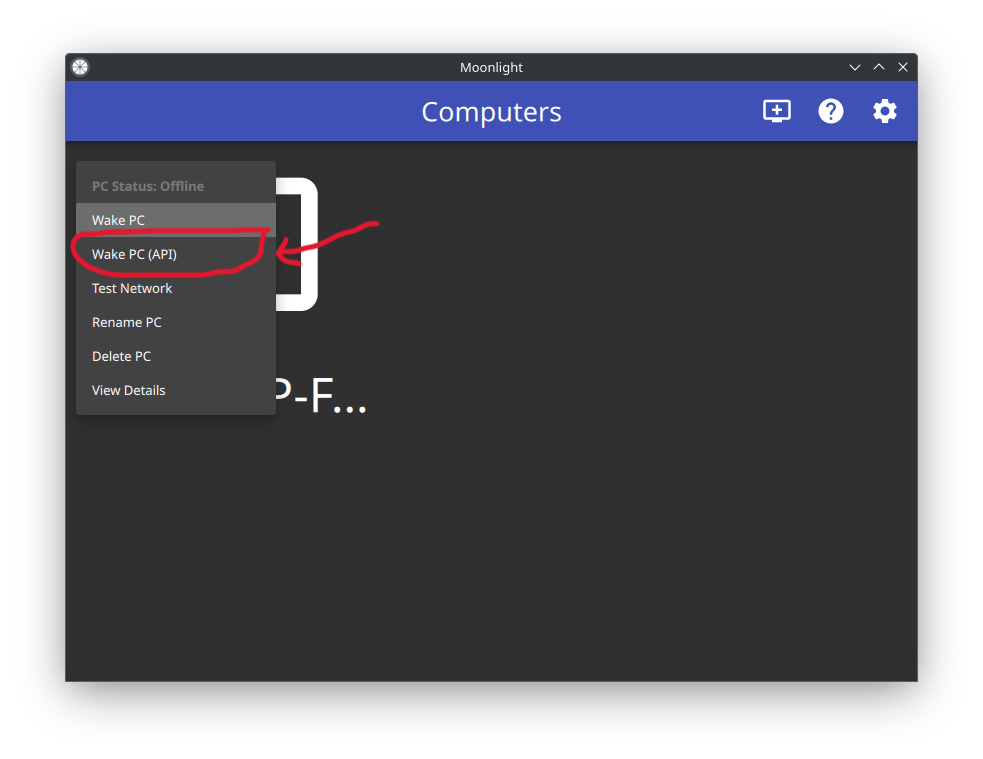
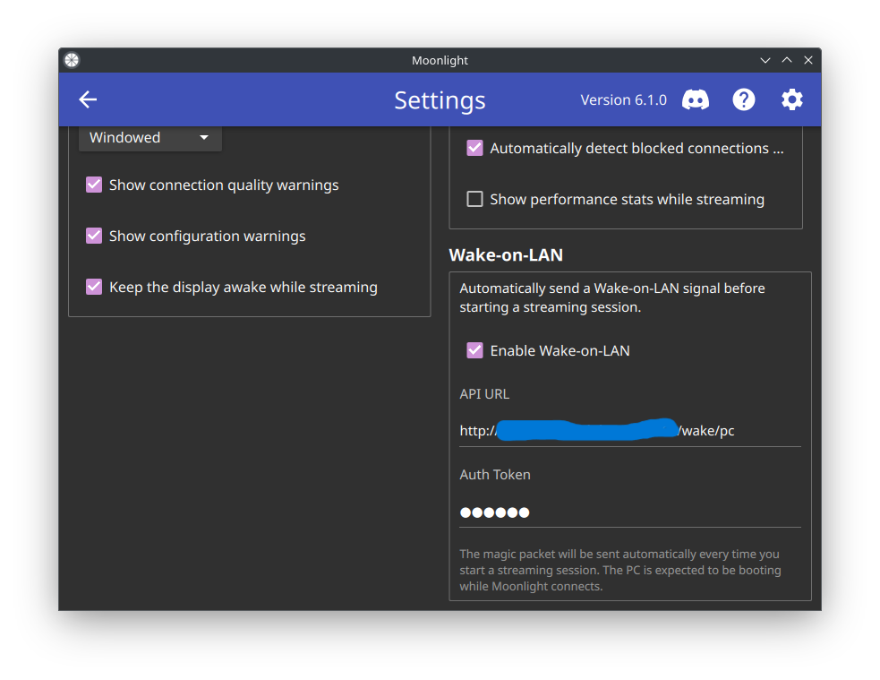
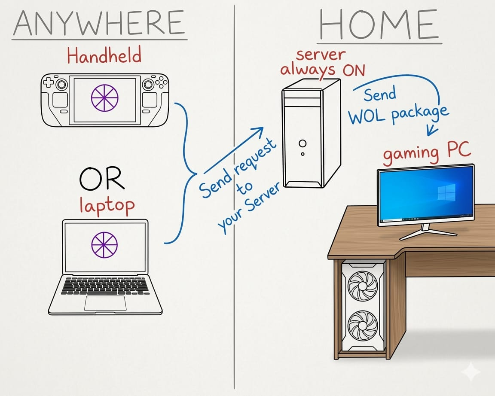

# What is remWOL-moonlight?

**remWOL-moonlight** is a project that integrates a new button directly into Moonlight that allows you to **wake your PC remotely from anywhere in the world**, with or without a VPN such as Tailscale.

---

# How does it work?

This project uses a **slightly modified version of Moonlight** that adds a **Wake PC (API)** button.  
This button calls a Wake-on-LAN server directly from the Moonlight interface.

### Workflow

1. You click **Wake PC (API)** in the Moonlight fork
2. Moonlight sends a request to  
   `GET /wake/<device>?token=<your-token>` on the WOL server
3. The server sends a **UDP magic packet** to the local network
4. Your PC powers on
5. Moonlight connects and starts streaming

---

# Requirements

- An **always-on device** on your LAN to run the WOL server (NAS, Raspberry Pi, home server, etc.)
- **Wake-on-LAN enabled in your PC BIOS** and working
- The **Moonlight fork installed on your streaming device** *(Linux AppImage only for now)*

---

# [beginner-friendly-guide on how to set everything up](guide/#beginner-friendly-guide)
